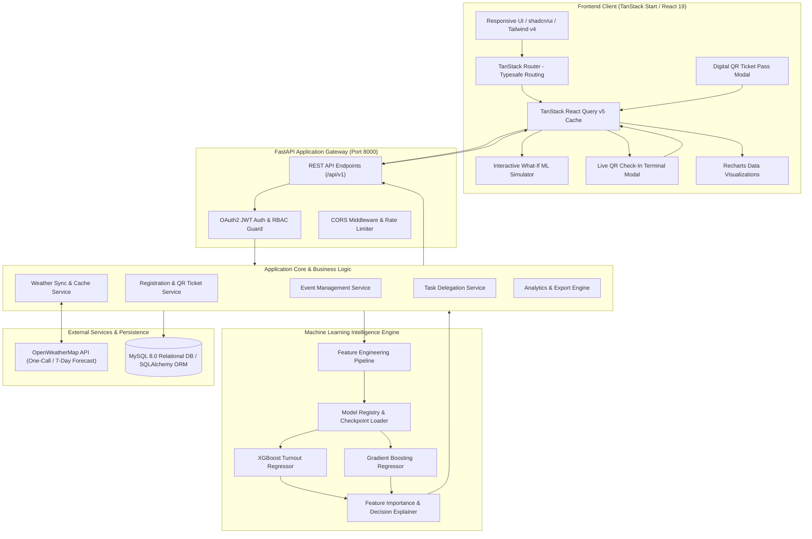
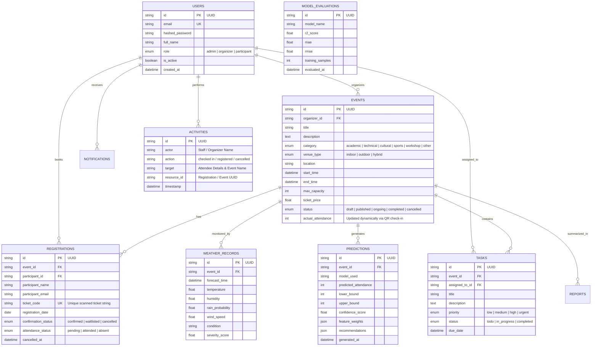

# 🎪 Eventify — Smart Event Management System with Attendance Prediction & Weather Forecast Integration

[](https://fastapi.tiangolo.com/)
[](https://react.dev/)
[](https://tanstack.com/start)
[](https://www.typescriptlang.org/)
[](https://www.python.org/)
[](https://tailwindcss.com/)
[](https://www.mysql.com/)
[](https://scikit-learn.org/)
[](https://www.docker.com/)

**Eventify** is an enterprise-grade, full-stack event intelligence and logistics management platform. By unifying modern event coordination workflows with **Machine Learning turnout regression models**, **real-time weather telemetry**, and a **high-speed QR-based attendance & check-in terminal**, Eventify empowers university administrators, corporate planners, and event organizers to eliminate attendance uncertainty, optimize catering and venue expenses, prevent check-in fraud, and proactively manage weather contingencies.

---

## 📑 Table of Contents

- [Key Highlights & Problem Statement](#-key-highlights--problem-statement)
- [System Architecture](#-system-architecture)
- [Comprehensive Feature Suite](#-comprehensive-feature-suite)
  - [1. Event Lifecycle & Studio Management](#1-event-lifecycle--studio-management)
  - [2. AI/ML Turnout Prediction Engine](#2-aiml-turnout-prediction-engine)
  - [3. Real-Time Weather Intelligence](#3-real-time-weather-intelligence)
  - [4. Operational Decision Support & Resource Planning](#4-operational-decision-support--resource-planning)
  - [5. Interactive "What-If" Prediction Simulator](#5-interactive-what-if-prediction-simulator)
  - [6. Participant Portal & Digital Ticketing](#6-participant-portal--digital-ticketing)
  - [7. QR-Based Smart Attendance & Live Check-In System](#7-qr-based-smart-attendance--live-check-in-system)
  - [8. Role-Based Access Control (RBAC) & Security](#8-role-based-access-control-rbac--security)
  - [9. Task Delegation & Staff Operations](#9-task-delegation--staff-operations)
  - [10. Business Intelligence, Analytics & Reporting](#10-business-intelligence-analytics--reporting)
  - [11. Real-Time Notification & Alert Hub](#11-real-time-notification--alert-hub)
- [📱 QR Attendance System Deep Dive](#-qr-attendance-system-deep-dive)
  - [Attendance Database Entities & Schema](#attendance-database-entities--schema)
  - [QR Code Generation & Digital Pass](#qr-code-generation--digital-pass)
  - [Live Camera & Optical Scanner Check-In Terminal](#live-camera--optical-scanner-check-in-terminal)
  - [Duplicate & Fraud Prevention Engine](#duplicate--fraud-prevention-engine)
  - [Attendance History & Audit Logs](#attendance-history--audit-logs)
  - [Attendance REST APIs](#attendance-rest-apis)
  - [Live Attendance Dashboard & Metrics](#live-attendance-dashboard--metrics)
- [Machine Learning Benchmark & Performance](#-machine-learning-benchmark--performance)
- [Technology Stack](#-technology-stack)
- [Database Schema & Entity Relationship](#-database-schema--entity-relationship)
- [REST API Reference Overview](#-rest-api-reference-overview)
- [Repository & File Structure](#-repository--file-structure)
- [Installation & Local Setup Guide](#-installation--local-setup-guide)
  - [Prerequisites](#prerequisites)
  - [Backend Setup (FastAPI + ML)](#backend-setup-fastapi--ml)
  - [Frontend Setup (TanStack Start + React 19)](#frontend-setup-tanstack-start--react-19)
  - [Running with Docker Compose](#running-with-docker-compose)
- [Environment Configuration (.env)](#-environment-configuration-env)
- [Testing & Quality Assurance](#-testing--quality-assurance)
- [User Roles & Access Matrix](#-user-roles--access-matrix)
- [License](#-license)

---

## 🎯 Key Highlights & Problem Statement

Academic institutions and conference hosts frequently struggle with a massive gap between **registered attendees** and **actual physical turnout**:
* **High No-Show Rates (20% – 50%)**: Leading to massive catering food waste, oversized hall bookings, and budget misallocation.
* **Unplanned Walk-in Surges**: Causing venue overflow, fire-code violations, seating shortages, and staff shortages.
* **Slow & Inaccurate Manual Check-Ins**: Bottlenecks at registration desks, lost paper manifests, duplicate check-ins, and inaccurate attendance counts.
* **Adverse Weather Disruptions**: Outdoor venues jeopardized by unexpected rainfall, high wind speeds, or heatwaves without advance contingencies.

### 💡 The Eventify Solution
Eventify solves these challenges by combining historical attendance patterns, registration velocity, event attributes, and live OpenWeatherMap forecast telemetry into high-accuracy regression models that compute real-time expected headcount, confidence bands, automated logistical recommendations, and an integrated QR check-in terminal for ground-truth physical verification.

$$\text{Event Metadata + Registrations} \oplus \text{Live Weather Forecast} \xrightarrow{\textbf{ML Pipeline}} \begin{cases} \textbf{Predicted Turnout} \pm \text{Margin of Error} \\ \textbf{Catering \& Staffing Recommendations} \\ \textbf{Weather Risk \& Contingency Action Plans} \\ \textbf{QR Verification \& Real-Time Ground-Truth Count} \end{cases}$$

---

## 🏗️ System Architecture



---

## 🚀 Comprehensive Feature Suite

### 1. Event Lifecycle & Studio Management
- **Full-Lifecycle Event Tracking**: Create, draft, schedule, publish, cancel, and complete events.
- **Dynamic Capacity Control**: Set hard maximum capacities, registration deadlines, and automated waitlist triggers.
- **Venue Categorization**: Support for **Indoor**, **Outdoor**, and **Hybrid** venues with physical address, GPS coordinates, and room allocation.
- **Categorization & Tagging**: Academic, Cultural, Technical, Sports, Workshops, Hackathons, and Seminars.
- **Organizer Dashboard**: Complete overview of upcoming, active, and completed events with ticket velocity graphs.

### 2. AI/ML Turnout Prediction Engine
- **Multi-Algorithm Regression Comparison**: Benchmarks 5 distinct regression models:
  1. **XGBoost Regression** (Production Primary)
  2. **Gradient Boosting Regression**
  3. **Random Forest Regression**
  4. **Decision Tree Regression**
  5. **Linear Regression**
- **Dynamic Feature Extraction**: Evaluates 12+ real-time features including total registered, days until event, hour of day, day of week, ticket price, target audience, historical category attendance, temperature, rain probability, wind speed, and weather condition severity.
- **Confidence Intervals & Risk Bands**: Calculates Upper/Lower bound turnout bounds and standard deviation.
- **Model Explainability**: Breaks down exact percentage contribution of each feature to the final prediction (e.g. 32% registration trend, 26% precipitation factor).

### 3. Real-Time Weather Intelligence
- **OpenWeatherMap Integration**: Automated background telemetry sync with 7-day forecasts and hourly resolution.
- **Weather Severity Score (0–100)**: Proprietary heuristic scoring index combining precipitation volume, cloud cover, wind speed, and extreme temperature thresholds.
- **Smart Outdoor Risk Assessment**:
  - 🟢 **Low Risk**: Ideal conditions for outdoor open-air events.
  - 🟡 **Moderate Risk**: Mild precipitation or high heat; suggests shaded canopies or cooling stations.
  - 🔴 **High / Severe Risk**: Heavy rain, storms, or severe winds; automatically triggers **Indoor Relocation Contingency Alerts**.
- **Offline Mock Weather Fallback**: Automatic seamless fallback mode for development or network-isolated deployments.

### 4. Operational Decision Support & Resource Planning
- **Automated Catering Headcount**: Recommends exact meal and refreshment counts incorporating safety buffers (+5% to +10%) based on predicted turnout rather than raw registrations, saving up to 35% in catering costs.
- **Venue Sizing & Hall Optimization**: Flags overcapacity warnings before ticket sales exceed safe predicted thresholds.
- **Staff-to-Attendee Ratio Calculator**: Recommends coordinator, usher, and security personnel allocations based on predicted crowds.
- **Contingency Checklist Generator**: Dynamic weather-driven checklists (e.g., umbrella stands, backup generators, waterproof AV covers).

### 5. Interactive "What-If" Prediction Simulator
- **Live Parameter Manipulation**: Real-time slider and dropdown controls to simulate hypothetical event scenarios without altering production data.
- **Instant Turnout Recalculation**: Adjust registration counts, switch weather from "Clear Sky" to "Heavy Rain", change venue from "Indoor" to "Outdoor", or alter ticket pricing and observe instantaneous turnout curve adjustments.
- **Side-by-Side Model Comparator**: Toggle between all 5 ML models to compare output variance and confidence intervals.

### 6. Participant Portal & Digital Ticketing
- **Searchable Event Explorer**: Multi-facet filter by category, date range, venue type, and availability.
- **1-Click Registration & Instant Pass**: Generates a verifiable digital ticket with dynamic QR code and unique confirmation code.
- **Personalized Schedule ("My Events")**: Overview of upcoming registrations with live weather warnings and schedule reminders.
- **Ticket Cancellation & Status Sync**: Real-time seat reallocation when a user cancels.

### 7. QR-Based Smart Attendance & Live Check-In System
- **Pure Software Web Check-In Terminal**: Dedicated browser modal for event staff equipped with standard device/webcam QR code scanning and manual ticket verification without requiring any proprietary scanning hardware.
- **Instant Fraud & Duplicate Prevention**: Rejects duplicate check-ins, flags cancelled passes, and prevents cross-event badge tampering.
- **Live Attendance Recalculation**: Dynamic, real-time incrementing of the event's physical headcount upon every successful scan.
- **Comprehensive Audit Trail**: Real-time logging of every scan action with timestamp, staff actor name, participant name, and verification state.

### 8. Role-Based Access Control (RBAC) & Security
- **Three Strict User Roles**:
  - 👑 **Admin**: Full platform oversight, user management, system-wide analytics, ML model retuning, and global settings.
  - 📋 **Organizer**: Event creation, attendee management, check-in terminal access, task delegation, ML predictions, and reports export.
  - 🎓 **Participant**: Event discovery, ticket bookings, personal QR passes, and event notifications.
- **OAuth2 JWT Token Authentication**: Secure token issuance, expiration handling, and refresh protocols.
- **Password Security**: Cryptographically salted passwords using **bcrypt**.
- **Route Guard Protection**: Backend dependency injection guards and frontend typesafe route redirect shields.

### 9. Task Delegation & Staff Operations
- **Event-Specific Task Boards**: Assign logistical duties (Catering, Stage & AV, Security, Check-in, Guest Relations) to team members.
- **Status & Priority Tracking**: `TODO`, `IN_PROGRESS`, `DONE` states with `LOW`, `MEDIUM`, `HIGH`, `URGENT` priority tags.
- **Due Date Reminders**: Deadlines integrated with the event execution timeline.

### 10. Business Intelligence, Analytics & Reporting
- **Turnout vs. Registration Ratio**: Visual charts analyzing show-up trends across categories, weekdays vs. weekends, and seasonal periods.
- **Weather Correlation Matrix**: Quantifies attendance drops relative to precipitation and temperature extremes.
- **Ground-Truth Historical Archives**: Record actual physical attendance after an event concludes to continuously improve future ML retraining datasets.
- **Multi-Format Export Engine**: Export polished executive summary reports to **PDF** and **Excel (.xlsx)** formats.

### 11. Real-Time Notification & Alert Hub
- **Weather Hazard Alerts**: Broadcast warnings when rain probability surpasses 60% for outdoor events.
- **Capacity Milestones**: Alerts organizers when event registrations reach 80%, 90%, and 100% capacity.
- **Task & Registration Activity**: Notifications for new registrations, cancellations, and task assignments.

---

## 📱 QR Attendance System Deep Dive

The QR Attendance and Check-In module delivers a zero-latency, fraud-proof entry verification workflow on event day:

```
┌────────────────────────────────┐       ┌────────────────────────────────┐       ┌────────────────────────────────┐
│      Participant QR Pass       │       │    Organizer Check-In Terminal │       │  Real-Time Attendance Storage  │
│  - Formatted Alphanumeric Code │ ────► │  - Standard Web Camera Stream  │ ────► │  - registrations (status=att)  │
│  - SVG QR Code (qrcode.react)  │       │  - Pure Software QR Detection  │       │  - events.actual_attendance++  │
│  - Download / Print Pass       │       │  - Duplicate / Fraud Blocker   │       │  - activities (immutable log)  │
└────────────────────────────────┘       └────────────────────────────────┘       └────────────────────────────────┘
```

### Attendance Database Entities & Schema

The attendance workflow is driven by 3 relational database tables:

1. **`registrations` Table** (`backend/app/models/registration.py`):
   | Column | Data Type | Constraints | Description |
   | :--- | :--- | :--- | :--- |
   | `id` | `VARCHAR(36)` | PK, UUID | Unique registration record identifier |
   | `event_id` | `VARCHAR(36)` | FK $\rightarrow$ `events.id` | Target event reference |
   | `participant_id` | `VARCHAR(36)` | FK $\rightarrow$ `users.id` | Registered user reference |
   | `participant_name`| `VARCHAR(150)`| NOT NULL | Full name of ticket holder |
   | `participant_email`| `VARCHAR(255)`| NOT NULL | Email address for confirmation |
   | **`ticket_code`** | `VARCHAR(20)` | **UNIQUE, NOT NULL** | Alphanumeric ticket string (e.g. `SEMS-E01-1001`) |
   | `registration_date`| `DATE` | NOT NULL | Date registration was submitted |
   | `confirmation_status`| `VARCHAR(20)`| NOT NULL | `"confirmed"`, `"waitlisted"`, `"cancelled"` |
   | **`attendance_status`**| `VARCHAR(20)`| NOT NULL | **`"pending"`**, **`"attended"`**, **`"absent"`** |
   | `cancelled_at` | `DATETIME` | NULLABLE | Timestamp if booking was cancelled |

2. **`events` Table** (`backend/app/models/event.py`):
   * **`actual_attendance`** (`INTEGER`): Synchronously recalculated upon every valid check-in.
   * **`status`** (`VARCHAR(20)`): Automatically advances to `"ongoing"` once check-ins begin on event day.

3. **`activities` Table** (`backend/app/models/activity.py`):
   * Records an immutable audit log entry for every check-in event (`actor="Staff"`, `action="checked in"`, `target="John Doe (SEMS-E01-1001) for Hackathon 2026"`).

---

### QR Code Generation & Digital Pass
* **Unique Code Generation**: Generated via `generate_ticket_code(event_id)` (`backend/app/utils/ticket_generator.py`) ensuring zero collision.
* **Vector SVG Rendering**: Rendered on the client using `qrcode.react` (`QRCodeSVG`) with high error correction level (`level="H"`, `size=160`), ensuring instant readability on mobile screens and paper printouts.
* **Pass Actions**: Participants can display the digital pass on mobile, download as an image, or print a formatted physical badge.

---

### Pure Software Web Camera QR Check-In Terminal
The **Check-In Terminal** (`frontend/src/components/events/checkin-terminal-modal.tsx`) provides:
* 📷 **Browser Camera QR Scanning**: Utilizes standard device/laptop webcams and smartphone cameras via `navigator.mediaDevices.getUserMedia` paired with browser QR detection for hands-free scanning.
* 🚫 **Zero Hardware Dependency**: Requires no external biometric devices, physical turnstiles, or dedicated barcode hardware.
* ⌨️ **Manual Code Entry**: Built-in software keyboard fallback for quick alphanumeric ticket verification when a camera is unavailable.
* 🔊 **Audio & Visual Confirmation**: Instant green glow and status feedback on successful check-in or duplicate warnings.

---

### Duplicate & Fraud Prevention Engine
The backend verification engine (`backend/app/services/registration_service.py` $\rightarrow$ `check_in_participant`) enforces multi-tier security checks:
```python
# Verification Logic Flow
1. Normalize input ticket code (strip whitespace, uppercase).
2. Query registration table -> Raise 404/ValueError if invalid.
3. Check confirmation_status == "cancelled" -> Reject cancelled ticket.
4. Verify event_id match -> Reject cross-event ticket fraud.
5. Check if attendance_status == "attended":
   -> Return Warning: "Attendee was already checked in at {timestamp}" (Prevent duplicate count).
6. Update attendance_status = "attended".
7. Recalculate event.actual_attendance = count(attended).
8. Append immutable log to activities table.
```

---

### Attendance History & Audit Logs
* **Terminal Live Stream**: Displays the 10 most recent check-ins in real time with attendee names, timestamps, and status badges (`Success`, `Already Checked In`, `Invalid`).
* **Global Activity Stream**: Tracks all check-in activities across organizers and staff members.
* **Post-Event Ground-Truth Archives**: The final `actual_attendance` count is stored permanently in the historical events dataset to retrain and refine future ML prediction models.

---

### Attendance REST APIs

| Method | Endpoint | Auth Level | Description |
| :---: | :--- | :---: | :--- |
| `POST` | `/api/v1/registrations/check-in` | Organizer / Admin | Scans/submits `ticket_code` & `event_id`, validates, marks attendance, updates counts, and returns attendee details. |
| `GET` | `/api/v1/registrations/my` | Participant | Retrieves logged-in participant's tickets, QR codes, and current attendance status. |
| `GET` | `/api/v1/registrations` | Organizer / Admin | Lists all registrations for an event with filter by `attendance_status` (`pending`, `attended`, `absent`). |
| `PUT` | `/api/v1/registrations/{id}/cancel` | Authenticated | Cancels a registration and invalidates the ticket code for check-in. |

#### Example Check-In Request / Response:
```json
// POST /api/v1/registrations/check-in
{
  "ticket_code": "SEMS-E01-1001",
  "event_id": "e01a-45bc-89de"
}

// 200 OK Response
{
  "success": true,
  "message": "Check-in successful! Welcome, Jane Doe.",
  "already_checked_in": false,
  "timestamp": "2026-08-30 14:22:05",
  "registration": {
    "id": "reg-101",
    "event_id": "e01a-45bc-89de",
    "event_title": "AI & Robotics Symposium 2026",
    "participant": "Jane Doe",
    "email": "jane.doe@university.edu",
    "status": "confirmed",
    "attendance": "attended",
    "ticket_code": "SEMS-E01-1001"
  }
}
```

---

### Live Attendance Dashboard & Metrics
The Event Detail & Dashboard screens display real-time physical attendance metrics:
* **Live Headcount Counter**: Real-time display of **Checked-In Attendees vs. Total Registered vs. Venue Capacity**.
* **Check-In Progress Bar**: Visual percentage of expected attendees currently in the hall.
* **No-Show & Attendance Ratio**: Instant metric calculated as:
  $$\text{Actual Attendance Rate} = \left(\frac{\text{Checked-In Count}}{\text{Total Confirmed Registrations}}\right) \times 100\%$$
* **Attendance Discrepancy Analysis**: Compares **ML Predicted Attendance** vs. **Actual QR Headcount** for post-event evaluations.

---

## 🧠 Machine Learning Benchmark & Performance

The system was evaluated on a comprehensive dataset of campus and corporate events across diverse weather conditions and venue configurations:

| Regression Algorithm | $R^2$ Score | MAE (Mean Absolute Error) | RMSE (Root Mean Sq Error) | Inference Latency | Status in System |
| :--- | :---: | :---: | :---: | :---: | :--- |
| **XGBoost Regression** | **0.946** (94.6%) | **12.4 Pax** | **16.1 Pax** | **~1.2 ms** | 🏆 **Primary Production Model** |
| **Gradient Boosting** | **0.928** (92.8%) | **14.9 Pax** | **19.2 Pax** | **~1.8 ms** | Secondary High-Accuracy Model |
| **Random Forest** | **0.912** (91.2%) | **16.8 Pax** | **21.5 Pax** | **~3.4 ms** | Ensemble Tree Benchmark |
| **Decision Tree** | **0.815** (81.5%) | **26.4 Pax** | **33.1 Pax** | **~0.4 ms** | Baseline Tree Benchmark |
| **Linear Regression** | **0.742** (74.2%) | **34.2 Pax** | **42.8 Pax** | **~0.1 ms** | Baseline Linear Model |

### Top Predictive Feature Importance Breakdown
```
Historical Category Turnout Rate ──██████████████████████████████  32%
Rain Probability & Weather Index ──████████████████████████        26%
Total Registered Attendees       ──██████████████████              20%
Days Before Event / Velocity     ──████████                        10%
Venue Type (Indoor vs. Outdoor)  ──██████                          7%
Ticket Pricing & Audience Level  ──███                             5%
```

---

## 🛠️ Technology Stack

### Backend Architecture
| Component | Technology | Description |
| :--- | :--- | :--- |
| **Framework** | [FastAPI](https://fastapi.tiangolo.com/) | Modern, asynchronous Python web framework |
| **Language** | [Python 3.11+](https://www.python.org/) | High-performance type-annotated runtime |
| **Database ORM** | [SQLAlchemy 2.0 (Async)](https://www.sqlalchemy.org/) | Asynchronous relational data persistence |
| **Migrations** | [Alembic](https://alembic.sqlalchemy.org/) | Schema migration and version control tool |
| **Validation** | [Pydantic v2](https://docs.pydantic.dev/) | High-speed data parsing and schema validation |
| **Machine Learning** | [Scikit-Learn](https://scikit-learn.org/) & [XGBoost](https://xgboost.readthedocs.io/) | Model training, preprocessing, cross-validation |
| **Serialization** | [Joblib](https://joblib.readthedocs.io/) | Model persistence and binary checkpoint loading |
| **Authentication** | [PyJWT](https://pyjwt.readthedocs.io/) & [Passlib (Bcrypt)](https://passlib.readthedocs.io/) | JWT OAuth2 token signing and password hashing |
| **Weather API** | [OpenWeatherMap API](https://openweathermap.org/) | Live atmospheric forecasts and telemetry |

### Frontend Architecture
| Component | Technology | Description |
| :--- | :--- | :--- |
| **Framework** | [TanStack Start](https://tanstack.com/start) | Full-stack SSR React framework powered by Nitro |
| **Routing** | [TanStack Router](https://tanstack.com/router) | 100% typesafe, file-based routing system |
| **UI Library** | [React 19](https://react.dev/) | Modern concurrent UI component runtime |
| **Language** | [TypeScript 5.8](https://www.typescriptlang.org/) | Strict end-to-end static type enforcement |
| **Styling** | [Tailwind CSS v4](https://tailwindcss.com/) | High-speed, utility-first CSS engine |
| **UI Primitives** | [shadcn/ui](https://ui.shadcn.com/) & [Radix UI](https://www.radix-ui.com/) | WAI-ARIA compliant, accessible component primitives |
| **Data Fetching** | [TanStack React Query v5](https://tanstack.com/query) | Smart caching, optimistic updates, background sync |
| **QR Code Engine**| [qrcode.react](https://github.com/zpao/qrcode.react) | High-resolution SVG QR pass rendering |
| **Charts** | [Recharts v2](https://recharts.org/) | Interactive, composable SVG visualizations |
| **Forms** | [React Hook Form](https://react-hook-form.com/) + [Zod](https://zod.dev/) | Type-safe form validation and state handling |
| **Icons & Motion**| [Lucide React](https://lucide.dev/) & [Motion](https://motion.dev/) | Modern iconography and fluid UI animations |

---

## 🗄️ Database Schema & Entity Relationship

The system utilizes an asynchronous MySQL schema designed for high-concurrency event registrations, QR attendance tracking, and analytics:



---

## 📡 REST API Reference Overview

The backend exposes a fully documented OpenAPI (Swagger) specification under `/api/v1`:

| Module | Endpoint | Method | Role | Description |
| :--- | :--- | :---: | :---: | :--- |
| **Auth** | `/api/v1/auth/register` | `POST` | Public | Register new user account |
| **Auth** | `/api/v1/auth/login` | `POST` | Public | OAuth2 password token login |
| **Auth** | `/api/v1/auth/me` | `GET` | Authenticated | Retrieve current user profile |
| **Events** | `/api/v1/events` | `GET` | Public | List & search events with filters |
| **Events** | `/api/v1/events` | `POST` | Organizer/Admin | Create a new event |
| **Events** | `/api/v1/events/{id}` | `GET` | Public | Fetch detailed event information |
| **Events** | `/api/v1/events/{id}` | `PUT` | Organizer/Admin | Update event metadata |
| **Events** | `/api/v1/events/{id}` | `DELETE` | Organizer/Admin | Cancel or delete an event |
| **Attendance & QR** | `/api/v1/registrations/check-in` | `POST` | Organizer/Admin | **QR check-in scanner, validation & live attendance increment** |
| **Attendance & QR** | `/api/v1/registrations/my` | `GET` | Participant | Retrieve user's digital tickets & QR codes |
| **Attendance & QR** | `/api/v1/registrations` | `GET` | Organizer/Admin | Query event attendee manifest & check-in statuses |
| **Attendance & QR** | `/api/v1/registrations/{id}/cancel`| `PUT`| Participant | Cancel ticket booking & invalidate QR code |
| **Predictions**| `/api/v1/predictions/event/{id}` | `GET` | Organizer/Admin | Fetch latest prediction & recommendations |
| **Predictions**| `/api/v1/predictions/simulate` | `POST` | Authenticated | Run "What-If" scenario simulation |
| **Predictions**| `/api/v1/models/benchmark` | `GET` | Authenticated | Retrieve 5-model evaluation benchmarks |
| **Weather** | `/api/v1/weather/event/{id}` | `GET` | Public | Fetch live event forecast telemetry |
| **Weather** | `/api/v1/weather/forecast` | `GET` | Public | Fetch 7-day campus forecast |
| **Tasks** | `/api/v1/tasks/event/{id}` | `GET` | Organizer/Admin | List task board for an event |
| **Tasks** | `/api/v1/tasks` | `POST` | Organizer/Admin | Create & assign operational task |
| **Analytics** | `/api/v1/analytics/summary` | `GET` | Organizer/Admin | System-wide turnout & KPI summary |
| **Reports** | `/api/v1/reports/event/{id}/pdf` | `GET` | Organizer/Admin | Generate downloadable PDF summary |
| **Reports** | `/api/v1/reports/export/excel` | `GET` | Admin | Export event attendance records to Excel |
| **Notifications**| `/api/v1/notifications` | `GET` | Authenticated | Retrieve unread user alerts |

Interactive API documentation is accessible at:
- **Swagger UI**: `http://localhost:8000/docs`
- **ReDoc**: `http://localhost:8000/redoc`

---

## 📁 Repository & File Structure

```text
eventify-smart-event-management-system/
├── backend/                             # FastAPI Backend Service
│   ├── app/
│   │   ├── api/v1/                      # API Endpoints & Route Handlers
│   │   │   ├── auth.py                  # Authentication & OAuth2 tokens
│   │   │   ├── events.py                # Event CRUD & lifecycle operations
│   │   │   ├── registrations.py         # Ticket booking, QR check-in & verification
│   │   │   ├── predictions.py           # ML inference & simulation endpoints
│   │   │   ├── models.py                # Model evaluation benchmarks
│   │   │   ├── weather.py               # OpenWeather telemetry routes
│   │   │   ├── tasks.py                 # Task delegation board
│   │   │   ├── reports.py               # Export engine (PDF/Excel)
│   │   │   ├── analytics.py             # Business intelligence & statistics
│   │   │   └── notifications.py         # User alerts & notifications
│   │   ├── core/                        # Configurations, Security & Dependencies
│   │   ├── database/                    # Async SQLAlchemy session & engine
│   │   ├── utils/
│   │   │   └── ticket_generator.py      # Unique ticket & QR code generator
│   │   ├── ml/                          # Machine Learning Pipeline
│   │   │   ├── datasets/                # Historical Event Attendance & Telemetry Dataset (2,500+ records)
│   │   │   ├── preprocessing.py         # Feature encoders & scalers
│   │   │   ├── feature_engineering.py   # Domain heuristics & temporal features
│   │   │   ├── train.py                 # Multi-model training pipeline
│   │   │   ├── evaluate.py              # Cross-validation & benchmark metrics
│   │   │   ├── explainability.py        # Feature importance calculations
│   │   │   ├── pure_models.py           # Self-contained standalone regressors
│   │   │   └── model_registry.py        # Checkpoint loader & inference runtime
│   │   ├── models/                      # SQLAlchemy Relational ORM Models
│   │   │   ├── registration.py          # Registration & Attendance status entity
│   │   │   ├── event.py                 # Event entity & actual attendance count
│   │   │   ├── user.py                  # User entity & RBAC roles
│   │   │   ├── activity.py              # Attendance & operational audit log
│   │   │   └── weather.py               # Atmospheric telemetry model
│   │   ├── schemas/                     # Pydantic Request/Response Models
│   │   ├── services/                    # Business Logic, Check-In & Prediction Services
│   │   │   └── registration_service.py  # Check-in validation & duplicate prevention
│   │   ├── seed.py                      # Database Seeder (Demo events, tickets, tasks)
│   │   └── main.py                      # Application Factory, Lifespan & Middlewares
│   ├── tests/                           # Unit & Integration Tests (Pytest)
│   ├── Dockerfile                       # Backend Container Spec
│   ├── docker-compose.yml               # Multi-container orchestration (FastAPI + MySQL)
│   └── requirements.txt                 # Python dependencies
│
├── frontend/                            # TanStack Start + React 19 Frontend
│   ├── src/
│   │   ├── routes/                      # File-based Route Tree
│   │   │   ├── index.tsx                # Landing page & value proposition
│   │   │   ├── dashboard.tsx            # Role-adaptive dashboard & attendance KPIs
│   │   │   ├── prediction.tsx           # "What-If" Turnout Simulator & ML benchmarks
│   │   │   ├── events/
│   │   │   │   ├── index.tsx            # Event Catalog with filters
│   │   │   │   ├── $eventId.tsx         # Event Detail Hub, Live Headcount & Pass
│   │   │   │   └── new.tsx              # Event Creation Studio with live prediction
│   │   │   ├── analytics.tsx            # Deep-dive charts & turnout correlations
│   │   │   ├── reports.tsx              # Turnout archives & export center
│   │   │   ├── weather.tsx              # 7-day campus forecast & risk index
│   │   │   ├── my-events.tsx            # Participant digital ticket wallet & QR passes
│   │   │   ├── users.tsx                # Admin User Management & RBAC
│   │   │   └── notifications.tsx        # Alert notification stream
│   │   ├── components/
│   │   │   ├── events/
│   │   │   │   └── checkin-terminal-modal.tsx # 📷 Live Camera QR Scanner Terminal
│   │   │   └── shared/
│   │   │       └── qr-ticket-modal.tsx  # 🎫 SVG QR Ticket Pass Modal
│   │   ├── services/                    # Typed API Client & Axios Interceptors
│   │   ├── hooks/                       # Custom React Hooks & Query Wrappers
│   │   ├── lib/                         # Utility helpers & formatters
│   │   └── types/                       # TypeScript Data Contract Definitions
│   ├── package.json                     # Frontend dependencies & scripts
│   ├── vite.config.ts                   # Vite 8 Build Configuration
│   └── tsconfig.json                    # Strict TypeScript compiler options
│
└── README.md                            # Comprehensive Root Documentation
```

---

## ⚡ Installation & Local Setup Guide

### Prerequisites
Ensure you have the following installed on your development machine:
- **Python**: Version `3.11+`
- **Node.js**: Version `20+` or **Bun**: Version `1.1+`
- **MySQL Database**: Version `8.0+` (or Docker)
- **Git**

---

### Backend Setup (FastAPI + ML)

1. **Navigate to the Backend Directory**:
   ```bash
   cd backend
   ```

2. **Create and Activate a Virtual Environment**:
   ```bash
   # On macOS/Linux:
   python3 -m venv venv
   source venv/bin/activate

   # On Windows (PowerShell):
   python -m venv venv
   .\venv\Scripts\Activate.ps1
   ```

3. **Install Dependencies**:
   ```bash
   pip install --upgrade pip
   pip install -r requirements.txt
   ```

4. **Configure Environment Variables**:
   ```bash
   cp .env.example .env
   ```
   *Edit `.env` to configure your MySQL database credentials and OpenWeatherMap API key (optional).*

5. **Train the ML Models & Generate Evaluation Benchmarks**:
   ```bash
   python -m app.ml.train
   ```
   *This trains all 5 regression models on 1,000+ event records, generates model binary checkpoints in `app/ml/models/`, and creates `benchmark.json`.*

6. **Seed Initial Database with Demo Data (Users, Events, Registrations, Tickets, Tasks, Weather)**:
   ```bash
   python -m app.seed
   ```
   *Default demo credentials created:*
   - **Admin**: `admin@eventify.com` / `admin123`
   - **Organizer**: `organizer@eventify.com` / `organizer123`
   - **Participant**: `participant@eventify.com` / `participant123`

7. **Start the FastAPI Development Server**:
   ```bash
   uvicorn app.main:app --reload --host 0.0.0.0 --port 8000
   ```
   Backend is now running at `http://localhost:8000`.

---

### Frontend Setup (TanStack Start + React 19)

1. **Navigate to the Frontend Directory**:
   ```bash
   cd ../frontend
   ```

2. **Install Dependencies**:
   ```bash
   # Using Bun (Recommended):
   bun install

   # Or using NPM:
   npm install
   ```

3. **Start the Development Server**:
   ```bash
   # Using Bun:
   bun dev

   # Or using NPM:
   npm run dev
   ```
   Frontend application is now running at `http://localhost:3000` (or `http://localhost:5173`).

---

### Running with Docker Compose

You can launch the complete system (FastAPI Backend, MySQL Database, and ML Engine) in isolated Docker containers with a single command:

```bash
cd backend
docker-compose up --build
```
The services will automatically configure networks, run migrations, and launch the API at `http://localhost:8000`.

---

## ⚙️ Environment Configuration (.env)

### Backend Configuration (`backend/.env`)
```ini
# Application Configuration
APP_NAME="Eventify Smart Event Management System"
ENVIRONMENT="development"
DEBUG=True
API_V1_STR="/api/v1"
SECRET_KEY="your-super-secret-jwt-signing-key-change-in-production"
ACCESS_TOKEN_EXPIRE_MINUTES=1440

# Database Configuration (MySQL)
DB_HOST="localhost"
DB_PORT=3306
DB_USER="root"
DB_PASSWORD="your_mysql_password"
DB_NAME="eventify_db"

# OpenWeatherMap API Integration
OPENWEATHER_API_KEY="your_openweather_api_key"
OPENWEATHER_CITY="Kathmandu"
OPENWEATHER_LAT=27.7172
OPENWEATHER_LON=85.3240
USE_MOCK_WEATHER=True # Set to False when using a real API Key

# Machine Learning Settings
DEFAULT_ML_MODEL="xgboost"
CONFIDENCE_THRESHOLD=0.85
```

### Frontend Configuration (`frontend/.env`)
```ini
VITE_API_BASE_URL="http://localhost:8000/api/v1"
VITE_APP_TITLE="Eventify"
```

---

## 🧪 Testing & Quality Assurance

### Running Backend Unit & Integration Tests
```bash
cd backend
pytest tests/ -v --disable-warnings
```
Tests cover:
- Authentication & JWT Token Verification
- Event CRUD & Capacity Validation
- QR Ticket Code Generation & Scanning Check-In
- Duplicate Check-In Prevention & Status Transitions
- Machine Learning Feature Transformation & Inference
- Weather Heuristic Risk Scoring

### Running Frontend Type Checks & Linters
```bash
cd frontend
# Run TypeScript compilation check
bun run typecheck

# Run ESLint validation
bun run lint
```

---

## 👥 User Roles & Access Matrix

| Feature / Screen | Admin | Organizer | Participant | Public Visitor |
| :--- | :---: | :---: | :---: | :---: |
| Browse Public Events & Schedule | ✅ | ✅ | ✅ | ✅ |
| Register for Event / Receive QR Ticket | ✅ | ✅ | ✅ | ❌ |
| Create / Edit / Delete Events | ✅ | ✅ | ❌ | ❌ |
| **Open Live QR Check-In Terminal & Scan Badges** | ✅ | ✅ | ❌ | ❌ |
| View ML Turnout Predictions & Insights | ✅ | ✅ | ❌ | ❌ |
| Run "What-If" Prediction Simulator | ✅ | ✅ | ✅ | ❌ |
| Assign Logistics Tasks & Checklists | ✅ | ✅ | ❌ | ❌ |
| View Weather Forecast & Risk Index | ✅ | ✅ | ✅ | ✅ |
| Manage User Roles & Permissions | ✅ | ❌ | ❌ | ❌ |
| Export Analytics (PDF & Excel Reports) | ✅ | ✅ | ❌ | ❌ |
| Retrain ML Models & Update Weights | ✅ | ❌ | ❌ | ❌ |

---

## 📄 License

This project is licensed under the **MIT License** — see the [LICENSE](LICENSE) file for details.

---

<p align="center">
  <b>Built with ❤️ for intelligent campus & enterprise event logistics.</b>
</p>
